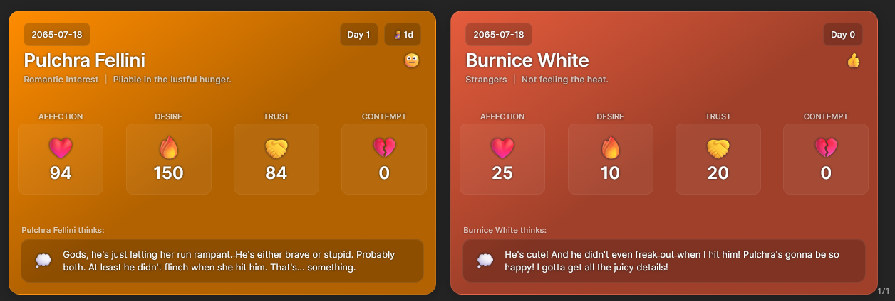

# Silly Sim Tracker

A Lumiverse extension that renders visually rich tracker cards from structured data embedded in character messages. Built for dating sims, RPGs, slice-of-life roleplay, or any scenario where you want to track character stats, relationships, biology, and story progression at a glance.



## Installation

1. **Copy the repo URL**: `https://github.com/prolix-oc/Lumiverse-SimTracker`
2. **Open Lumiverse → Extensions** (puzzle-piece icon).
3. **Click Install**, paste the URL, and confirm.
4. The extension appears in your installed list, and a configuration panel is available from the Extensions drawer.

## Features

### Core
- **Dynamic tracker cards** rendered from tracker data emitted by the LLM in each turn.
- **Multi-character support** — display stats for several characters per message, with tabbed and non-tabbed layouts.
- **Real-time rendering** — cards update as new messages stream in.
- **Flexible data shapes** — both JSON and YAML are accepted; the parser normalizes both into the canonical character-array form.

### Customization
- **Multiple built-in templates** — Bento Style, Pulse Thread, Dating Sim (multiple positions/layouts), Omni-Tracker RPG Edition, Tactical HUD, and more.
- **Custom fields** — define your own data fields and the system prompt automatically describes them to the LLM.
- **Card color customization** — per-character background colors with automatic dark variants.
- **Optional thought bubbles** — toggle the per-character `internal_thought` display.
- **Inline data hiding** — keep the visual cards while stripping the raw tracker tag from chat display.

### Wire format
The canonical format is an **XML tag** in the assistant's reply:

```xml
<tracker type="sim">
{
  "worldData": { "current_date": "2025-08-10", "current_time": "14:30" },
  "characters": [
    { "name": "Alice", "ap": 75, "dp": 60, "tp": 80, "cp": 20 }
  ]
}
</tracker>
```

The `type` attribute matches your configured code-block identifier (default: `sim`). YAML is accepted inside the tag as well as JSON. The backend tolerates and migrates older formats (legacy flat maps like `{ "Alice": { ... } }` and hidden-div wrappers) automatically.

### Slash commands
- `/sst-add` — insert a tracker tag into the latest assistant message.
- `/sst-convert` — convert any tracker block in the current chat to the canonical XML-tag form.
- `/sst-regen` — re-generate the tracker block on the latest message via the secondary LLM.

### Macros
- `{{sim_tracker}}` — expands to the active preset's system prompt at send time.
- `{{last_sim_stats}}` — expands to the most recent tracker payload from this chat's history (survives message deletion via a backend side-channel).

### Templates & positioning
Templates can declare their preferred mount position with an HTML comment at the top:

```html
<!-- POSITION: LEFT -->
```

Recognized values:
- `TOP` — above the message body.
- `BOTTOM` — below the message body (default).
- `LEFT` — fixed left sidebar.
- `RIGHT` — fixed right sidebar.

If a template doesn't declare a position, the position from the settings panel is used. Side-mounted templates render in a vertically-centered container that adapts to viewport size.

### Handlebars + DOM helpers
Templates are Handlebars. Built-in helpers cover comparison, math, string formatting, color manipulation, and **DOM measurement** (so a template can size itself to viewport or sidebar width). See `docs/template-guide-handlebars-helpers.md` and `docs/template-guide-dom-helpers.md`.

### Inline template packs
"Packs" are lightweight inline-display bundles applied globally on top of the active template — useful for one-off message decorations independent of the main tracker. Importable as JSON. See `docs/template-guide-inline-packs.md`.

## Data structure

### Modern (recommended)
```json
{
  "worldData": {
    "current_date": "2025-08-10",
    "current_time": "14:30"
  },
  "characters": [
    { "name": "Alice", "ap": 75, "dp": 60, "tp": 80, "cp": 20 }
  ]
}
```

### YAML (equivalent)
```yaml
worldData:
  current_date: "2025-08-10"
  current_time: "14:30"
characters:
  - name: "Alice"
    ap: 75
    dp: 60
    tp: 80
    cp: 20
```

### Legacy flat-map (still parsed)
```json
{
  "current_date": "2025-08-10",
  "current_time": "14:30",
  "Alice": { "ap": 75, "dp": 60, "tp": 80, "cp": 20 }
}
```
Legacy data is auto-normalized to the modern shape on parse. Use `/sst-convert` to rewrite chat history in place.

## Configuration

Settings live in the Lumiverse extension panel:

1. **Template** — pick from the bundled presets or any imported user preset.
2. **Tracker tag** — name of the XML tag the parser looks for (default `tracker`).
3. **Identifier** — value of the `type` attribute / code-block fence (default `sim`).
4. **Preferred format** — JSON or YAML (parser accepts both regardless).
5. **Default card color** — base background color for cards; per-character `bg` overrides.
6. **Thought bubbles** — show/hide `internal_thought`.
7. **Hide raw tracker blocks** — strip the source tag from chat display.
8. **Custom fields** — declare additional fields surfaced to the LLM in the system prompt.
9. **System prompt** — the preset's prompt (editable per-template).
10. **Inline template packs** — import / enable per-pack global decorations.

### Built-in templates

| Preset | Style | Position |
|---|---|---|
| Bento Style Tracker (default) | Card grid | Bottom |
| Dating Sim Tracker (variants) | Card / sidebar | Top / Bottom / Left / Right / Tabbed |
| Pulse Thread Tracker | Compact narrative panel with fertility/biology gauges | Bottom |
| Omni-Tracker: RPG Edition | RPG-style stat sidebar | Right (sidebar, tabbed) |
| Tactical Combat HUD | HUD-style combat panel | Right (sidebar, tabbed) |
| Wide Style Tracker | Wide card | Bottom |
| Disposition Tracker | Disposition-focused sidebar | Right (sidebar, tabbed) |
| Message Replacement (Macro) | Inline replacement via `{{sim_tracker_positioned}}` macro in the message | Inline |

Additional presets are seeded into Lumiverse storage on first install and appear in the template dropdown alongside built-ins.

## Preset import / export

The settings panel exposes:

- **Export Preset** — bundles the current template HTML, prompt, custom fields, and settings into a JSON file you can share.
- **Import Preset** — loads a preset JSON, saves it as a user preset, and selects it.
- **Import Inline Pack** — installs an inline-display pack from JSON.

User-imported presets live alongside built-ins in the template dropdown and persist via Spindle storage.

## Authoring custom templates

The `template-helper.js` script extracts/assembles template bundles for development:

```bash
# Extract a bundled template into editable parts
node template-helper.js extract tracker-card-templates/pulse-thread-tracker.json

# Edit extracted/pulse-thread-tracker/{template.html,prompt.md,fields.json,settings.json}

# Reassemble back into a single JSON
node template-helper.js assemble extracted/pulse-thread-tracker/assemble-config.json \
  --out tracker-card-templates/pulse-thread-tracker.json
```

See the guides in `docs/`:
- `template-guide-handlebars-helpers.md` — every Handlebars helper available.
- `template-guide-dom-helpers.md` — viewport/sidebar measurement helpers.
- `template-guide-positioned-cards.md` — top/bottom/macro-positioned card templates.
- `template-guide-non-tabbed-sidebar.md` — single-character sidebar templates.
- `template-guide-tabbed-sidebar.md` — multi-character tabbed sidebar templates.
- `template-guide-inline-packs.md` — inline-display packs.

## Build

This repo ships pre-built `dist/backend.js` and `dist/frontend.js`. To rebuild:

```bash
bun install
bun run build
```

See `AGENTS.md` for the full development reference.
